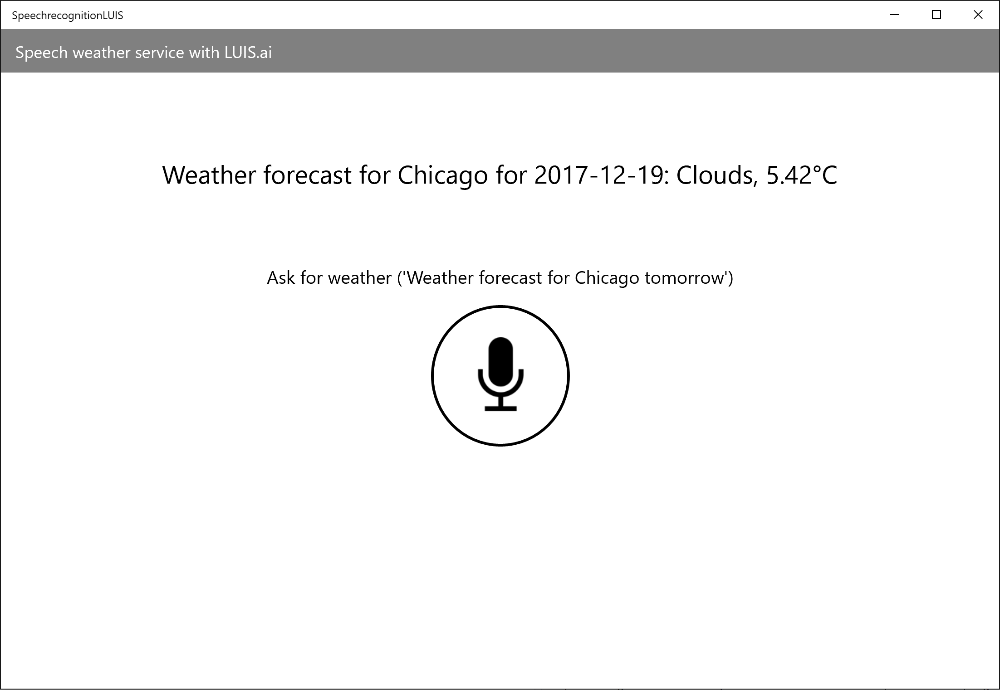
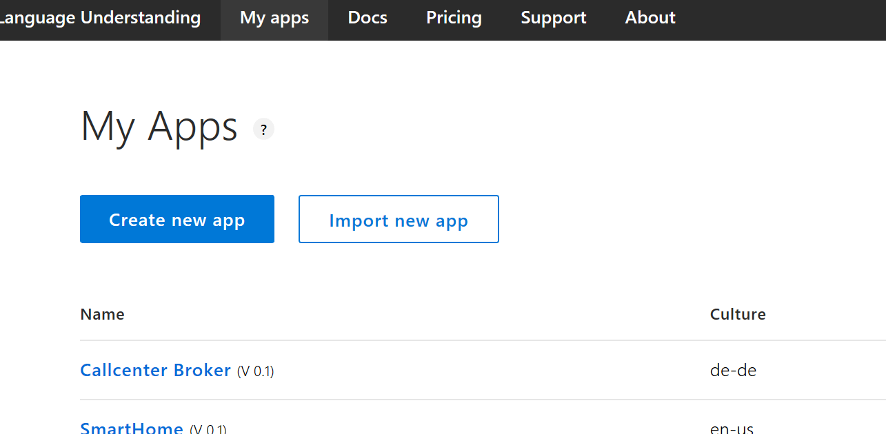
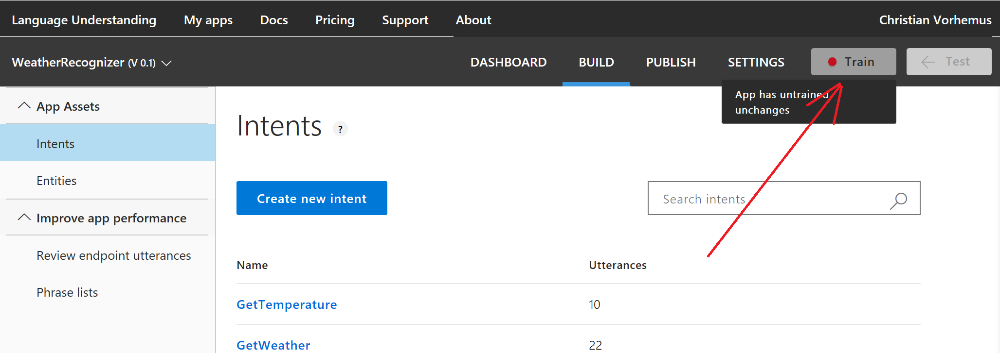
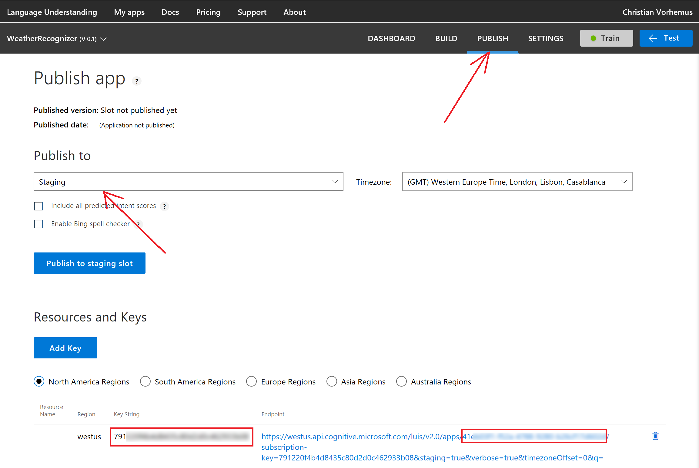
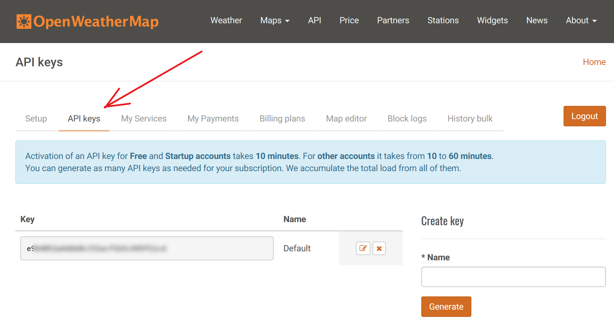

# Windows 10 app with speech recognition and LUIS
This is a sample UWP app written in C# that listens to voice commands and returns weather forecasts. For speech-to-text, the Windows.Media.SpeechRecognition classes are used, LUIS.ai is the engine for natural language processing. 
Beside this app, you may consider using Cortana and leverage Cortana's built in speech recognition. In this case, take a look at "[Cortana Skills](https://docs.microsoft.com/en-us/cortana/skills/)". Check the [FAQ](https://docs.microsoft.com/en-us/cortana/skills/faq) to see which languages "Cortana Skills" are currently supporting



## Getting started

### 1) Set up LUIS
Download or clone this repository
```
git clone https://github.com/christian-vorhemus/speechrecognition-luis
```
Open a browser and go to [www.luis.ai/applications](https://www.luis.ai/applications). You need an Azure subscription to continue, if you don't have one, create a free account [here](https://azure.microsoft.com/free/).

Click on "Import new app" and select the WeatherRecognizer.json file from the repository you just downloaded. Choose a name (e.g. "WeatherRecognizer") and click "Done".



Open the "WeatherRecognizer" project in LUIS and click on "Train"



Wait till the training is complete and then select "Publish". 



In the "Publish to" dropdown select "Staging". Note down the "Key String" (left red rectangle) and the app ID (right red rectangle) and hit the "Publish to staging slot" button.

### 2) Set up openweathermap

Get an account at [www.openweathermap.org](https://www.openweathermap.org).

Got to [home.openweathermap.org](https://home.openweathermap.org/) and click on "API keys". You can create a new key by giving it a name and click "Generate". Copy the key.



### 3) Configure the project

Make sure you have the latest version of Visual Studio installed, you can download the latest version [here](https://www.visualstudio.com/en/downloads).

Open "SpeechrecognitionLUIS.sln" and go to "ViewModels/MainPageViewModel.cs".

Replace luisAppId, subscriptionKey, openweathermapKey with your own values. Build the project.

When the app opens, click on the microphone icon and ask a weather related question (e.g. "What's the weather in Vienna today?"). Make sure that your device has a microphone.

## Additional Information

This app uses Template 10. If you want to find out more about T10, take a look at this [MVA course](https://mva.microsoft.com/en-us/training-courses/getting-started-with-template-10-16336).
